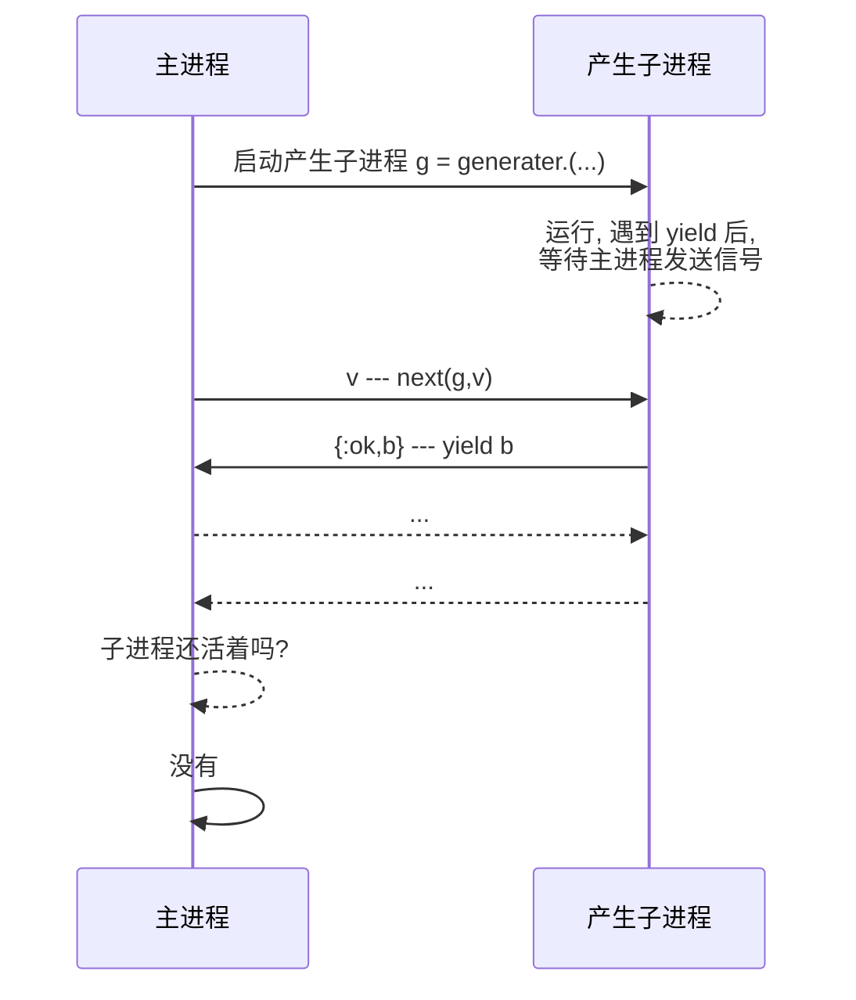

# 第六章 异步编程

## 承诺(Promise)

Elixir 对异步编程的支持由 `Task` 模块提供. 但是我很少使用它,
`Task` 不是一个代数结构类型, 因此无法完成链式操作.
Javascipt 中的 Promise 不一样, 它成功的解决了回调地狱问题.
因此我希望能把这个类型引入到 Elixir 语言中.

我们将要定义的 Promise 模块, 对外提供的接口有 8 个函数, 其中 6 个来源于
Javascript 的 Promise API. 但是这里没有定义 `catch` 函数.
`catch` 在 Elixiir 中是保留字, 不允许用作函数名, 因此这里用 `on_error` 来代替.

最后的 2 个函数: `of/1` 和 `map(promise,fun/1)` 是函子的通用函数.

1. `Promise` 构造函数 `Promise.new((reslove,reject)->any)`
2. `Promise` 特化的构造函数 `Promise.reslove(v)` 把 `v`
转化为已完成的`Promise` 结构.
3. `Promise` 特化的构造函数 `Promise.reject(v)` 把 `v`
转化为已拒绝的 `Promise` 结构.
4. `Promise` 的转化换函数 `Promise.then(promise,fun, error_hanlder\\nil)`
5. `Promise` 错误处理函数`Promise.on_error(promise,fun)`
6. `Promise` 解构函数 `await(promise)` 返回 `Promise` 中包含的类型
7. 函子构造函数 `Promise.of({:resloved|:rejected,v})` 把任意类型的值 `v`
转化为一个 `Promise` 结构.
8. 函子通用转化换函数 `Promise.map(promise,fun)`

我们首先来看看 `Promise` 的 API.

`Promise` 对象有 5 个状态: 待执行(`:pending`), 已完成(`:resolved`),
已拒绝(`:rejected`) 和出错 (`:error`).

这一点和 Javascript 的 API 不一样. 所以要把 `:rejected` 拆分成两个状态,
是为了处理错误的方便. Javascript 的异步函数中, 是使用 `try...catch` 来处理错误的.
在 Elixir 社区, 很少使用 `try...catch`, 更常规的做法是用标签来标记返回结果.
所以, 这里我们细分了拒绝的状态. 在这里的分类中,
`:rejected` 通过 `Promise.rejecte/1`, `Promise.of(v, :rejected)`
或者动态创建 `Promise` 时调用 `rejecter/1` 创建的 `Promise`.
而错误指的是客户端代码运行过程中抛出错误.

当需要提取 Promise 的值的时候, 调用 `Promise.await` 函数.

`Promise.await/1` 会等待 Promise 对象从待执行变为已执行的状态.
`Promise.await/1` 返回 `{tag, result}`.
`tag` 的可能值为 `:resolved`, `:rejected`, `:error`, `:stop`.
我们的 Promise 是用 `GenServer` 实现的, `:stop` 表示 `Promise` 服务已经终止.
### 动态构造函数 `new(fun)`

`Promsie.new/1` 接受一个二元函数 `fun`, 返回一个待执行状态的 `Promise` 结构.

`fun` 函数规范为: `(resolver,rejecter -> any)`.
其中 `resolver`, `rejecter` 都是一元函数, 其调用后, 会改变 `Promise` 的状态.

`fun` 的返回值会被丢弃, 但是如果 `fun` 抛出了异常, 那么 `Promise` 的状态将转化为
**拒绝状态**. 在 `fun` 中, 如果调用 `resolver/1` 或 `rejecter/1`, 之前, 没有出错,
那么 `Promise` 状态将转化为: **完成** 或 **拒绝**. `resolver/1` 或 `rejecter/1`
应该是 `fun` 执行的最后一个语句, 当其中一个执行后, `fun` 的后续代码都不会再被执行.

`Promise.new/1` 调用 `GenServer.start/2` 启动 `Promise` 服务进程.
`GenServer.start/2` 会使用他的第二个参数来调用回调函数 `init/1`.

```elixir
defmodule Corner.Promise do
  use GenServer
  @receive_time 60 * 1000
  def new(fun, receive_time \\ @receive_time) when is_function(fun, 2) do
    {:ok, pid} = GenServer.start(__MODULE__, [fun, self(), receive_time])
    %__MODULE__{pid: pid}
  end

  def init([fun, pid,receive_time]) do
    state = %{
      receive_time: receive_time,
      sender_ref: make_ref(),
      state: :pending,
      sender: pid,
      timer_ref: nil,
      result: nil
    }

    {:ok, state, {:continue, fun}}
  end
  #...
end
```
在初始化函数 `init/1` 中, 我们只初始化了状态, 但是还没有完成对函数 `fun` 的执行.
所以, 这里, 我们返回的时一个三元的元组.

`GenSerrver` 接收到 `init/1` 返回的三元元组后, 会理解执行 `handle_continue` 回调.
```elixir
def handle_continue(fun, %{state: :pending} = state) do
  %{sender_ref: sender_ref} = state
  
  run_and_handle_error(
    fn _ ->
      fun.(&resolver(sender_ref, &1), &rejecter(sender_ref, &1))
      throw({sender_ref, :stop})
    end,
    state
  )
end
```
`run_and_handle_error/2` 执行函数, 捕获错误, 并改变服务进程的状态, 此外,
这个函数还对潜在的内厝泄露问题做了防护.

当客户端疏忽, 创建一个 `Promise` 后从来左右在通过 `await/1` 取回结果,
`Promise` 对应的服务进程就会永远运行在系统中. 为了避免这种情况,
当 `Promise` 处于完成状态之后, 一定时间内, 客户端不发送继续处理的请求,
也不取回结果, 系统将会自动终结, 以完成垃圾回收的工作. 这里默认的时间
由 `@receive_time` 提供, 当前为 1 分钟.
可以为 `Promise.new/2` 提供第二个参数来调整这个值.

当接受到 `:run` 消息后, 取消接受记时. 执行函数 `fun`. 执行结束后, 重新开始计时.
```elixir
defp run_and_handle_error(fun, %{state: tag, result: result} = state) do
  if state.timer_ref, do: :timer.cancel(state.timer_ref)
  try do
    if tag == :error, do: fun.({tag, result}), else: fun.(result)
  catch
    kind, error -> catch_error(kind, error, __STACKTRACE__, state)
  else
    v ->
      message = {:timeout, state.sender_ref}
      timer_ref = Process.send_after(self(), message, state.receive_time)
      %{state | timer_ref: timer_ref, state: :resolved, result: v}
      |> noreply()
  end
end
```
`catch_error/4` 用来处理所有的异常情况.
```elixir
defp catch_error(:throw, {ref, :stop}, _, %{sender_ref: ref} = state) do
  send(state.sender, {:result, {:stop, :done}})
  Process.exit(self(), :kill)
end
defp catch_error(:throw, {ref, tag, result}, _, %{sender_ref: ref} = state) do
  message = {:timeout, ref}
  timer_ref = Process.send_after(self(), message, state.receive_time)
  %{state | timer_ref: timer_ref, state: tag, result: result}
  |> noreply()
end
defp catch_error(tab, error, stacktrace, %{sender_ref: ref} = state)
     when tab in [:error, :throw] do
  message = {:timeout, ref}
  timer_ref = Process.send_after(self(), message, state.receive_time)
  result = {error, stacktrace}
  %{state | timer_ref: timer_ref, state: :error, result: result}
  |> noreply()
end
```
前两个分句捕获的是 `Promise` 服务进程内部抛出的消息.
第三个分句捕获客户端提供的函数 `fun` 运行过程中产生的错误.
如果 `fun` 函数中既没有调用 `reslover/1` 也没有调用 `rejecter/1`, 而且没有产生错误,
那么 `Promise` 服务进程就是抛出 `{ref, :stop}`, 这样第一个分句就会执行.
结果就是像客户端发送 `{:result, {:stop, :done}}` 信息后, 立刻终止运行了.

而当 `fun` 函数中有调用 `reserver/1` 或 `rejecter/1` 的时候, 第二个分句会执行.
重新开始了客户端接受计时, 并更新了 `Promise` 服务器进程的其他状态信息.

### 数据构造函数

`Promise.of(v,tag\\:resolved)`, `Promise.reslove(v)` 和 `Promise.reject(v)`
是三个数据构造函数. 用来把 `v` 置于 `Promise` 结构内.
`Promise.reslove(v)` 是 `Promise.of(v)` 的代理;
`Promise.rejcet(v)` 与 `Promise.of(v, :rejected)` 效果一样.

这些构造函数和 `new/1` 的最大差别在于, 这些函数构造的 `Promise` 服务绝对不会出现死锁,
使用 `Promise.new(fun)` 构造 `Promise` 服务的时候, 如果在 `fun` 既没有调用
`resolver/1`, 也没有 `rejectoer/1`, 且没有引发异常的化, `Promise` 进程就会死锁.

```elixir
def of(v, tag \\ :resolved) do
  new(fn resolver, rejecter ->
    if tag == :resolved do
      resolver.(v)
    else
      rejecter.(v)
    end
  end)
end

def resolve(v) do
  of(v)
end

def reject(v) do
  of(v, :rejected)
end
```

### 数据转化函数

`map/1`, `then/1-2` 和 `on_error/1` 是三个函数转化函数.

其中 `then/1-2` 和 `on_error/1` 与 Javascript 的 Promise API
向对应的.[^js_promise]. `then/1` 只处理 **:resloved** 状态的 Promise,
`then/2` 接受两个转化函数, 第一个处理 **:resloved** 状态的,
第二个处理 **:rejected, :error** 状态的.
`on_error/1` 只处理 **:rejected** 和 **:promise** 状态的的 Promise.

[^js_promise]: 见 MDN [Promise 参考页面](https://developer.mozilla.org/zh-CN/docs/Web/JavaScript/Reference/Global_Objects/Promise)

`map` 是为了配合 Elixir 的函数子句而提供的 API. 也就是说,
无论 `Promise` 的状态是什么, 都统一有一个函数来处理.

对于 `:resloved` 和 `:rejected` 状态的 `Promise`, `map` 的处理函数 `fun`,
接受到的数据就是 Promise 中的数据. 当 `Promise` 的状态是 `:error` 的时候,
`map` 的处理函数接受到的是 `{:error, {v,[stack]}}`.

`map/1`, `then/1-2` 和 `on_error/1` 做的工作是类似的, 分成三个函数,
只是为了客户端调用的方便. 它们只是向 `Promise` 服务进程发送异步的 
`{:run,fun1,fun2}` 消息.

在本章的开头, 我抱怨 `Task` 模块不是一个代数结构, 并许诺为 Elixir 种引入 `Promise`.
`Promise` 是代数结构. 代数结构的关键就是, 数据转化后已经形成对应的结构.
对 `Promise` 来说, 就是要求所有的转化函数, 必须也返回 `Promise` 结构.
如此, 才能完成链式调用. 这就是什么, 在 `async_send_run/3` 的最后返回 `Promise`
结构的原因.

```elixir
def then(promise, fun1, fun2 \\ nil)
def then(%__MODULE__{} = this, fun1, fun2)
    when is_function(fun1, 1) and
           (fun2 == nil or is_function(fun2, 1)) do
  async_send_run(this, fun1, fun2)
end

def map(%__MODULE__{} = this, fun) when is_function(fun, 1) do
  async_send_run(this, fun, fun)
end

def on_error(%__MODULE__{} = this, fun) when is_function(fun, 1) do
  async_send_run(this, nil, fun)
end

defp async_send_run(%__MODULE__{pid: pid} = m, fun1, fun2) do
  if is_pid(pid) and Process.alive?(pid) do
    GenServer.cast(pid, {:run, fun1, fun2})
    m
  else
    %{m | state: :stop}
  end
end
```

异步消息 `{:run, fun1,fun2}` 的处理函数如下:
```elixir
def handle_cast({:run, fun, _}, %{state: :resolved} = state)
    when is_function(fun, 1) do
  run_and_handle_error(fun, state)
end

# reject happend but no error_hanlder
def handle_cast({:run, _fun, nil}, %{state: tag} = state)
    # _fun is not nil
    when tag != :resolved do
  noreply(state)
end

# resolved happend but just error_hanler
def handle_cast({:run, nil, _fun}, %{state: :resolved} = state) do
  noreply(state)
end

def handle_cast({:run, _fun, fun}, %{state: tag} = state)
    when tag != :resolved do
  run_and_handle_error(fun, state)
end
```
第一个分句是 `:resloved` 状态时, `fun` 转化数据的情形.
第二个分句是 `:rejected` 状态, 但是并没有提供错误处理函数的情形.
第三个分句是 `:res;pved` 状态, 但是没有提供数据转化函数的情形.
第四个分句是错误状态的, 使用 `fun` 处理错误处理状态的情形.

### await
`Promise.await/1` 函数用来提取 `Promise` 中记录的值.
本质来说, `await/1` 是客户端向 `Promise` 服务进程发送同步请求: `{:await, pid}`.
但是当 `Promise` 服务进程已经死掉了, 那么这个函数会返回会返回 `{:stop, :done}`.

```elixir
def await(%{} = this) do
  if Process.alive?(this.pid) do
    send(this.pid, {:await, self()})
    receive do
      {:result, message} -> message
    after
      :infinity -> {:stop, :bad}
    end
  else
    {:stop, :done}
  end
end
```

### 最后的提示

最后要注意的是, 这里全部都是函数, 没有宏, 所以**不要使用 `import` 语句**,
如果使用 import 导入全部函数, 那么会引发 `Promise.then/1` 与 `Kernel.then/2`
的命名冲突.

## 流(Stream)

Generater 是 ES6 中引入的新的语法, 让我们可以通过 `function*` 来创建产生子.
有了这个语法, 在 Javascript 中, 我们就可以产生无限数量的序列了.

Elixir 标准库中, 提供了 `Stream` 模块.
任意的在枚举过程中, 一个接一个产生的可枚举数据类型, 都可以叫做 `Stream`[^stream].
虽说 Stream 模块提供**组合**和**创建** `Stream` 的函数.
但是从函数的数量上来说, 这个库中提供的, 创建 `Stream` 的函数只有 3 个,
堪堪占据全部函数的十分之一左右.

[^stream]: 见 [Stream 模块文档](elixir/1.13.0/Stream.html)

对于无限序列, `Stream` 模块提供的 API 非常方便.
比如让我们产生一个斐波那契数列的 `Stream`:

```elixir
Stream.unfold({1, 1}, fn {a, b} -> {a, {b, a + b}} end)
|> Stream.take(10)
|> Enum.to_list()
```

但是, 当要求产生特定的序列时, 就开始变得怪异了. 比如, 产生斐波那契数列中,
和小于 10000 的序列.

```elixir
Stream.unfold(
  {1, 1, 0},
  fn {a, b, sum} -> if sum < 1000, do: {a, {a + b, b, sum + a}}, else: nil end
)
|> Enum.to_list()
```

这样的 API, 虽然能完成工作, 但是代码的可读性非常差, 阅读这样的代码, 往往一头雾水.

这是因为控制流由 `Stream.unfold/2` 控制的.
`Stream.unfold(acc,fun)` 通过判断 `fun` 返回结果,
来决定为流中产生什么元素或者是否结束序列.
具体的说, 当 `fun` 返回的是 `nil` 的时候, 序列结束.
当 `fun` 返回一个二元元组的时候, 元组的第一个元素作为序列的元素,
第二个元素作为继续调用 `fun` 的参数.
这就是为什么, `Stream.unfold/2` 第二个参数的类型为
`(acc() -> {element(), acc()} | nil)` 的原因.

如果要完成更加复杂的工作, 例如写一个从文件中读取内容的 `Stream`,
那么就必须使用 `Stream.resource/3`. 和 `Stream.unfold/2` 类似,
`Stream.resource/3` 根据回调函数的返回结果来决定如何产生流的元素和什么时候结束流.
但是 `Stream.resource(start_fun,next_fun,end_fun)`
因为要调用 `end_fun` 完成最后的资源清理工作,
所以不能仅要求 `next_fun` 返回 `nil` 来表示流结束.
`next_fun` 的类型规范是: `(acc() -> {[element()], acc()} | {:halt, acc()})`.
当返回的结果为`{:halt,acc()}` 的时候, `Stream.resource` 调用 `end_fun(acc)`,
并结束流序列. 但为什么表示需要参数元素的时候, 不能直接返回 `{elememt(), acc()}`
而必须把要产生的序列放在列表中呢? 这是因为如果返回 `{element(),acc()}` 那么,
`Stream.unfold/2` 就无法产生一个包含 `:halt` 的 Stream 序列了.

Stream 让我想起了 Javascript 的产生子. 如果 Elixir 提供了产生子,
那么产生子函数结合上面定义的 Promise 就可以写出更加容易读的 Stream.

## 产生子(Generater)

定义产生子的宏, 就叫做 `defgen` 吧.

我们使用 Javascript 产生子函数类似的语法. 在 `defgen` 上下文中, 可以使用 `yield`.
表达式 `yield a` 会等待 迭代子的 `next/2` 的执行. 待 `next/2` 执行后, `next/2`
会得到返回值 `{:ok, a}`; 而在产生子内部, `yield a` 的返回值是 `next/2` 的第二个参数.
产生子函数中最后一个 `yield` 语句执行完成后, 再调用 `next/2` 会返回 `:done`.

在 Javascript 中, 产生子函数返回的迭代器(记为 `g`), 第一次调用 `g.next(v)` 时,
传给 `next` 方法的值 `v` 被丢弃了. 我一直认为这时一个实现的 bug.
现在有机会来自己实现产生子, 我希望, 第一次调用 `next(g,v)` 传入的值 `v` 不会被丢弃.
在第一次调用 `next/2` 的时候, 就可以为 `next/2` 的第二参数提供任意的值.

那么该如何来实现呢? Elixir 现有的语法中, 如何组合出这样的功能呢?
首先 `receive` 会暂停一个进程的执行, 直到收到需要的数据, 才接着执行.
所以, 产生子函数, 应该运行在另外的一个进程中, 当`defgen` 返回的匿名函数被调用的时候,
产生子函数开始执行, 直到遇到第一个 `yield` 语句, 停止执行. 等待 `next/2` 函数发送信号.
当产生子进程, 收到 `next/2` 的发送的信号后, 表达式 `yield a` 完成如下工作:

1. 参数 `a` 发送给 `next`
2. 把 `next` 发送过来的数据作为 `yeild a` 的返回值传递后其他语句
3. 继续执行其他语句, 直到遇到新的 `yeild` 语句

`defgen name do...end` 产生一个匿名函数, 这个匿名函数绑定给了变量 `name`.
调用匿名函数 `name` 会启动产生子进程, 并返回一个透明结构.
这个透明结构, 对应于 Javascript 的产生子迭代器,
但是, 在我们这里, 用它来作为客户端与产生子进程通信的信道.
如果我们愿意, 还可以为这个信道/迭代器实现枚举协议,
这样就可以使用 `Enum` 模块和 `for` 来处理产生的序列了.

`defgen fun(a,b) do...end` 和 第 5章
[&Lt;定制新结构&Gt;](ch05.new_constructor.md)
的递归匿名函数小节中, 定义的 `fn!/2` 宏有大量的功能是相同的:

1. 它们都定义匿名函数,
2. 在宏的上下文中, 都可以完成对定义的匿名函数的递归调用.
3. 还帮助我们把这个匿名函数绑定给了变量.

这些共同的功能, 都是如何构造递归调用的匿名函数的, 所以, 可以把通用的代码,
提出到 Ast 辅助模块中.

其中功能完全一样的是对子句参数个数的检查. 我们把这个函数命名为
`clauses_arity_check(ast)`.
然后就是构建递归匿名函数的工作, 这两个匿名函数几乎是一样的,
所不同的是向递归匿名函数中添加的参数个数不一样, 稍微把定义 `fn!` 宏时用到的
`make_fn/3` 做一点修改, 就变成了 `make_recursive_fn/4`. 

```elixir
def make_recursive_fn(name, body, correct_args_fun) do
  new_body = Enum.map(body, &clause_handler(correct_args_fun, name, &1))
  {:fn, [], new_body}
end
defp clause_handler(
       correct_args_fun,
       name_ast = {atom, _, _},
       {:->, meta, [args | body]}
     ) do
  new_body = Macro.postwalk(body, &correct_recursive_call(atom, &1))
  new_args =
    if new_body != body do
      correct_args_fun.(args, name_ast)
    else
      name_atom = "_#{atom}" |> String.to_atom()
      correct_args_fun.(args, {name_atom, [], nil})
    end
  {:->, meta, [new_args | new_body]}
end
# ast of `atom.(...args)` -> ast of `atom.(atom, ...args)`.
defp correct_recursive_call(atom, {{:., m1, [{atom, _, _} = fun]}, m2, args}) do
  {{:., m1, [fun]}, m2, [fun | args]}
end
defp correct_recursive_call(_, ast), do: ast
```
这里, 我们添加的新参数 `correct_args_fun`. `fn!/2` 的相关代码, 只要用 `Ast`
模块中的代码替换原来的相关代码, 就可以完成更新.

在 `Ast` 模块的帮助下, 我们就可以专心写与 `defgen` 相关的核心功能了.

```elixir
defmodule Corner.Generater do
  defstruct ref: nil, pid: nil, async: false
  alias Corner.Ast

  defmacro defgen(name, async \\ false, do: block) do
    case Ast.clauses_arity_check(block) do
      {:ok, arity} ->
        tem_fun = {:TEM_fun, [], nil}
        tem_fun_ast = Ast.make_recursive_fn(name, block, &make_args/2)
        params = Macro.generate_arguments(arity, nil)

        quote do
          unquote(name) = fn unquote_splicing(params) ->
            unquote(tem_fun) = unquote(tem_fun_ast)
            async = unquote(async)
            ref = make_ref()
            me = self()

            fun = fn ->
              try do
                unquote(tem_fun).(unquote(tem_fun), me, ref, unquote_splicing(params))
              rescue
                error -> send(me, {ref, {:error, error, __STACKTRACE__}})
              end
            end

            pid = spawn(fun)
            struct(unquote(__MODULE__), pid: pid, ref: ref, async: unquote(async))
          end
        end
        |> Macro.postwalk(&yield_to_send(async, &1))
      # |> tap(&(Macro.to_string(&1) |> IO.puts()))

      :error ->
        {:=, [name, {:fn, [], block}]}
    end
  end
  # other ...
end
```
`defgen` 的定义和 `fn!` 的定义非常的像, 差别只有两处,
第一处是为递归匿名函数修改参数的函数 `make_args/2` 定义不同.
产生子函数, 需要两个额外的参数表示产生子进程的 `pid` 和用来做通信参考的 `ref`.
这个改动也是非常的简单, 只需要把这两个参数加载函数名之后就可以了.
```elixir
@pid {:pid, [], nil}
@ref {:ref, [], nil}
defp make_args([{:when, meta, args}], fun) do
  [{:when, meta, [fun, @pid, @ref | args]}]
end

defp make_args(args, fun) do
  [fun, @pid, @ref | args]
end
```
第二个改动是 `defgen` 定义最后的对产生的抽象语法树的遍历.
在本节的开始, 讲到在 `defgen` 上下文中, 是可以使用关键字 `yield` 的.
最后的对抽线语法树的遍历, 就是处理关键字 `yield`.

简单来说, `c = yield expression` 要被转化为:
```elixir
c = receive do
  v -> send(pid,{ref,[expresssion]})
end
```
对于的代码如下:
```elixir
@doc """
     Transform `c = yield a`
     """ && false
defp yield_to_send(async, {:=, m1, [left, {:yield, _, _} = yield_exp]}) do
  receive_and_send = yield_to_send(async, yield_exp)
  {:=, m1, [left, receive_and_send]}
end
@doc """
     Transform `yield a` to
     `
     receive do
       v -> send(pid,{ref,[a]})
       v
     end
     `
     """ && false
defp yield_to_send(async, {:yield, _meta, exp}) do
  pid = @pid
  ref = @ref
  return_value =
    if async do
      quote do
        [Promise.reslove(unquote(exp))]
      end
    else
      quote do
        unquote(exp)
      end
    end
  quote do
    receive do
      v ->
        send(unquote(pid), {unquote(ref), unquote(return_value)})
        v
    end
  end
end
defp yield_to_send(_, a), do: a
```
为了更好的理解 `defgen` 到底如何工作, 打开 `defgen` 定义中注释掉的调试语句,
看看, `defgen` 到底是把代码转化成了什么样子:
```elixir
import Corner.Generater

defgen my_generater do
  a, b when a > b ->
    c = yield(a)
    d = yield(c + b)
    yield(d)

  a, b ->
    yield(a)
    yield(b)
end
```
转后后的代码为:
```elixir
my_generater = fn arg1, arg2 ->
  TEM_fun = fn
    _my_generater, pid, ref, a, b when a > b ->
      c =
        receive do
          v ->
            send(pid, {ref, [a]})
            v
        end

      d =
        receive do
          v ->
            send(pid, {ref, [c + b]})
            v
        end

      receive do
        v ->
          send(pid, {ref, [d]})
          v
      end

    _my_generater, pid, ref, a, b ->
      receive do
        v ->
          send(pid, {ref, [a]})
          v
      end

      receive do
        v ->
          send(pid, {ref, [b]})
          v
      end
  end

  me = self()
  ref = make_ref()

  fun = fn ->
    try do
      TEM_fun.(TEM_fun, me, ref, arg1, arg2)
    rescue
      error -> send(me, {ref, {:error, error, __STACKTRACE__}})
    end
  end

  pid = spawn(fun)
  struct(Corner.Generater, pid: pid, ref: ref, async: false)
end
```

代码张开后, 一切非常清楚, 新产生的匿名函数, 调用后会启动一个新进程,
并返回一个产生子结构 `Corner.Generater`, 它对应于 Javascript 产生子函数返回的迭代子. 
所以剩下的代码, 就是为为 `Cornder.Generater` 定义 `next/2` 方法了.
```elixir
def next(%__MODULE__{} = m, v \\ nil) do
  if running?(m) do
    %{pid: pid, ref: ref} = m
    send(pid, v)
    receive do
      {^ref, [v]} -> {:ok, v}
      {^ref, v} -> v
    end
  else
    :done
  end
end
```
`running?/1` 是一个简单的方法, 用来判定产生子的工作进程是否还或者.
此外, 我们还定义了一个 `running?/1` 的否定式 `done?/1`:
```elixir
def running?(%__MODULE__{pid: pid}) do
  pid && Process.alive?(pid)
end

def done?(%__MODULE__{} = m), do: !running?(m)
```

如何使用定义好的产生子函数呢?
```elixir
g = my_generater.(3, 2)
{:ok, 3} = g |> next(1) # c is 1
{:ok, 3} = g |> next(4) # d is 4
{:ok, 4} = g |> next(:any)
true = g |> done?()
```
`defgen` 对标的 Javascript 产生子函数返回的也是迭代子, 可以使用 `for-of`
语法完成迭代操作. Elixir 中, 只要实现可枚举协议 (Enumerable), 就可以使用
`for` 特殊表单了. 那么为产生子结构提供枚举实现吧.
`Enumerable` 定义了 4 个回调函数, 其中最核心的是 `reduce(t,acc,fun)`.
```elixir
defimpl Enumerable, for: Corner.Generater do
  alias Corner.Promise
  alias Corner.Generater, as: G
  require Corner.Assign, as: Assign

  def reduce(%G{}, {:halt, acc}, _fun) do
    {:halted, acc}
  end

  def reduce(%G{} = g, {:suspend, acc}, _fun) do
    {:suspended, acc, fn _acc -> Process.exit(g.pid, :kill) end}
  end

  def reduce(%G{} = g, {:cont, acc}, fun) do
    if G.done?(g) do
      {:done, acc}
    else
      get_next(g, acc, fun)
    end
  end
  #....
end
```
当 `reduce/3` 的第一个分句被调用的时候, 表示迭代正常完成了, 所以把最后的结果
`acc` 返回就好了.
第二个分句被调用, 说明客户端已经得到了结果, 不需要后续的数据了,
因为产生子背后是运行的进程, 当用户不在需要产生子后, 背后的进程就应该终止,
第二个分句返回的元组的第三个元素是一个匿名函数, 它就是完成最后资源清理工作的.
第三个分句是正常的递归过程, 当产生子已经完成了, 返回结果就好了; 如果还没有完成,
那么调用 `get_next/3` 继续迭代.
```elixir
defp get_next(%G{} = g, acc, fun) do
  case G.next(g) do
    {:ok, v} ->
      if g.async or is_struct(v, Promise) do
        {_tag, v} = Promise.await(v)
        if is_struct(v, Promise), do: Promise.await(v), else: v
      else
        v
      end
      |> Assign.to(new_v)
      reduce(g, fun.(new_v, acc), fun) #Loop
    {:error, error, stack} ->
      {:done, {:error, error: error, stack: stack}}
    :done ->
      {:done, acc}
  end
end
```
`get_next/3` 实际上不过对 `Generater.next/1` 返回结果分情况处理而已.
如果迭代得结果是一个 `Promise` 结构, 那么首先从 Promise 中提取结果,
如果不是 Promise 那么直接继续下一轮得迭代.
迭代的工作最后转化为对第 11 行对 `reduce/3` 的递归调用.

`Enumerable` 除了 `reduce/3` 外还有 `count/1`, `member?/2` 和 `slince/1`.
对产生子来说, 无法不遍历产生子就获得答案; 而遍历生产子, 遍历完成后, 产生子进程就结束了.
无法通过这些函数返回的信息, 进一步来处理产生子的内容了.
所以, 这些函数只是简单的返回 `{:error, __MODULE__}`.
```elixir
@_ {:_, [if_undefined: :apply], Elixir}
for {fun, args} <- [count: [@_], slice: [@_], member?: [@_, @_]] do
  def unquote(fun)(unquote_splicing(args)) do
    {:error, __MODULE__}
  end
end
```
因为实现了 `Enumerable` 协议, 所以, 可以是使用 `Enum` 模块和 `for`
特殊表单来处理我们的产生子.
```elixir
defgen gen2 do
  () ->
    yield(1)
    yield(2)
    yield(3)
end

g = gen2.()

[1, 2, 3] =
  for v <- g do
    v
  end

true = done?(g)
```

## 异步函数(async)

Javascript 中还有异步函数的概念.
为了和 Javascript 的异步编程 API 保持一致, 定义异步函数的宏, 命名为 `async`.
在前面, 我们已经定义 `Corner.Promise` 模块.
`async` 要做的最主要的工作就是修改抽象语法树, 把抽象语法树的返回值,
封装成 `Corner.Promise` 结构.
`async` 在其上下文中, 还为 `Corner.Promise` 命名了别名,
并导入了 `Corner.Promise.await/1-2`.
这样, 在其内部就可以方便的处理 `Promise` 结构了.

当前为函数, 私有函数, 匿名函数以及上一节的产生子提供了异步支持.

首先, 让我们看看函数和私有函数如果完成异步定义的. `def/2` 和 `defp/2` 的返回结果
转化为 Promise 结构就好了. `return_promsie/1` 函数就是完成这工作的.
`async` 中的其他代码, 不过调用 `def/2` 或 `defp/2` 宏来创建函数或私有函数而已.
```elixir
defmodule Corner.Async do
  defmacro async({atom, _meta, args}, do: body) when atom in [:def, :defp] do
    new_body = return_promise(body)

    case atom do
      :def ->
        quote do
          def(unquote_splicing(args), do: unquote(new_body))
        end

      :defp ->
        quote do
          defp(unquote_splicing(args), do: unquote(new_body))
        end
    end
  end
  #...
end
```
那么改如何把一个函数体的返回值转化为 Promise 呢? 或者是,
怎么才能在抽象语法树中识别出返回值呢?
其他函数中, 比如 C 语言家族中, 都是用 `return expression` 来表示函数的返回值,
因此可以从抽象语法树中识别出来, 但是 Elixir 中不是这样的, 在抽象语法树中,
是无法识别出返回值的. 不过在 Elixir 中,  可以使用 `try`
特殊表单来获得一个代码块的返回值. `return_promise/1` 就是这样做的.
```elixir
defp return_promise(ast) do
  quote do
    alias Corner.Promise
    import Corner.Promise, only: [await: 2, await: 1]
    try do
      unquote(ast)
    rescue
      err ->
        Promise.reject({err, __STACKTRACE__})
    else
      v ->
        if is_struct(v, Promise) do
          v
        else
          Promise.reject(v)
        end
    end
  end
end
```
现在让我们看看如何为匿名函数提供异步支持.
```elixir
defmacro async({:fn, meta, ast}) do
  new_ast = arrow_return_promise(ast)
  {:fn, meta, new_ast}
end
defp arrow_return_promise(abs) do
  walker = fn
    {:->, meta, [args, body]} ->
      new_body = return_promise(body)
      {:->, meta, [args, new_body]}
    ast ->
      ast
  end
  Macro.postwalk(abs, walker)
end
```
匿名函数使用 `fn` 特殊表达来定义, 它和 `def/2` 不一样,
需要自己提取分句的每个分句的函数体.
在 `arrow_return_promise` 中定义的匿名函数 `walker` 就是完成这个工作的.

最后是对 `defgen` 宏的支持.
```elixir
defmacro async({:defgen, _, [fun_name]}, do: block) do
  new_block = arrow_return_promise(block)
  quote do
    import Corner.Generater
    alias Corner.Promise
    import Corner.Promise, only: [await: 1]
    defgen(unquote(fun_name), true, do: unquote(new_block))
  end
end
```
`defgen` 的异步支持, 非常像 `fn` 的异步支持. 但是因为 `defgen` 是我们自己定义的宏,
所以, 我们需要首先向用户的环境中导入 `Corner.Generater.defgen/2-3` 和
`Corner.Promise.await/1`. 我们还为 `Corner.Promise` 引入了别名, 这样,
在 `defgen` 的上下文中, 我就可以使用较为紧凑的 `Promise` 来写代码了.

最后, 检验时刻到, 我们可以像下面的代码那样来使用 `async` 来写代码了:

```elixir
import Corner.Async

async defgen(fun) do
  a, b ->
    yield(Promise.reslove(3))
    yield(a)
    yield(b)
end
is_function(fun, 2)#true

for v <- fun.(2,1) do
  v
end #[3,2,1]
```
