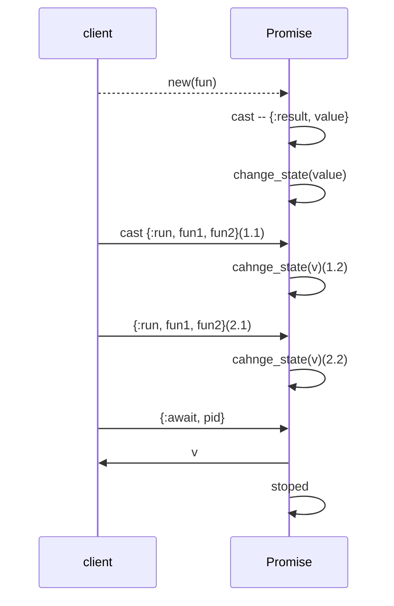
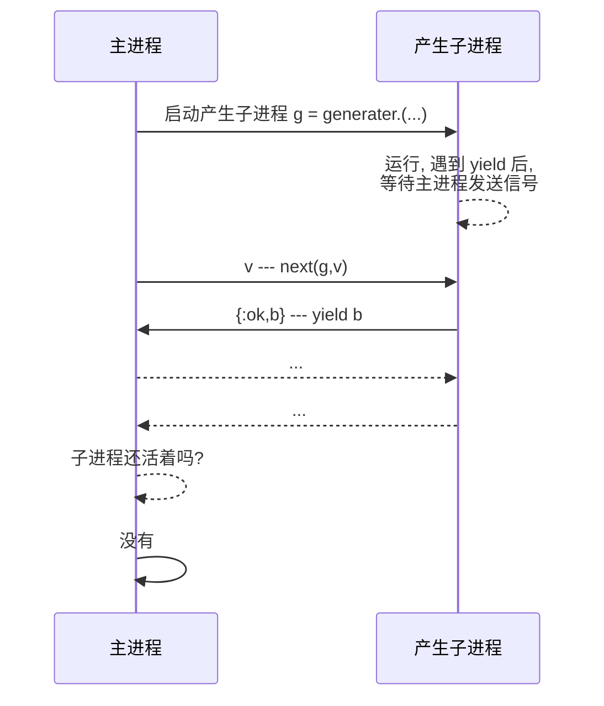

# 异步编程

## 承诺(Promise)

Elixir 对异步编程的支持由 `Task` 模块提供. 但是我很少使用它,
`Task` 不是一个代数结构类型, 因此无法完成链式操作.
Javascipt 中的 Promise 不一样, 它成功的解决了回调地狱问题.
因此我希望能把这个类型引入到 Elixir 语言中.

我们将要定义的 Promise 模块, 对外提供的接口有 8 个函数, 其中 6 个来源于
Javascript 的 Promise API. 但是这里没有定义 `catch` 函数.
`catch` 在 Elixiir 中是保留字, 不允许用作函数名, 因此这里用 `on_error` 来代替.

最后的 2 个函数: `of/1` 和 `map(promise,fun/1)` 是函子的通用函数.

1. `Promise` 构造函数 `Promise.new((reslove,reject)->any)`
2. `Promise` 特化的构造函数 `Promise.reslove(v)` 把 `v`
转化为已完成的`Promise` 结构.
3. `Promise` 特化的构造函数 `Promise.reject(v)` 把 `v`
转化为已拒绝的 `Promise` 结构.
4. `Promise` 的转化换函数 `Promise.then(promise,fun, error_hanlder\\nil)`
5. `Promise` 错误处理函数`Promise.on_error(promise,fun)`
6. `Promise` 解构函数 `await(promise)` 返回 `Promise` 中包含的类型
7. 函子构造函数 `Promise.of({:resloved|:rejected,v})` 把任意类型的值 `v`
转化为一个 `Promise` 结构.
8. 函子通用转化换函数 `Promise.map(promise,fun)`

我们首先来看看 `Promise` 的 API.

`Promise` 对象有 5 个状态: 待执行(`:pending`), 已完成(`:resolved`),
已拒绝(`:rejected`), 出错 (`:error`) 和超时 (`:timeout`).

这一点和 Javascript 的 API 不一样. 所以要把 `:rejected` 拆分成三个状态,
是为了处理错误的方便. Javascript 的异步函数中, 是使用 `try...catch` 来处理错误的.
在 Elixir 社区, 很少使用 `try...catch`, 更常规的做法是用标签来标记返回结果.
所以, 这里我们细分了拒绝的状态. 在这里的分类中,
`:rejected` 通过 `Promise.rejecte/1`, `Promise.of(v, :rejected)`
或者动态创建 `Promise` 时调用 `rejecter/1` 创建的 `Promise`.

当需要提取 Promise 的值的时候, 应该调用 `Promise.await` 函数.

`Promise.await/1` 会永久等待 Promise 对象从待执行变为已执行的状态.
`Promise.await/2` 接受的第二个参数为等待时间. 
在限定时间内, 承诺状态变为完成的话, 其返回结果和 `Promise.await/1` 一样.
超时后, `Promise.await/2` 返回值为 `{:timeout, pid}`. `pid` 
为执行上一步的进程的 PID.

总结一下, `Promise.await` 返回 `{tag, result}`.
`tag` 的可能值为 `:resolved`, `:rejected`, `:error`, `:stop`, `:timeout`.
这里, 我们使用 `GenServer` 来实现 `Promise`. 客户端和 `Promise` 的交互如下图:

### 动态构造函数 `new(fun)`

`Promsie.new/1` 接受一个二元函数 `fun`, 返回一个待执行状态的 `Promise` 结构.

`fun` 函数规范为: `(resolver,rejecter -> any)`.
其中 `resolver`, `rejecter` 都是一元函数, 其调用后, 会改变 `Promise` 的状态.

`fun` 的返回值会被丢弃, 但是如果 `fun` 抛出了异常, 那么 `Promise` 的状态将转化为
**拒绝状态**. 在 `fun` 中, 如果调用 `resolver/1` 或 `rejecter/1`, 之前, 没有出错,
那么 `Promise` 状态将转化为: **完成** 或 **拒绝**. `resolver/1` 或 `rejecter/1`
只应该只有一个函数被调用, 如果在 `fun` 内都被调用, 那么先调用谁,
`Promise` 的状态就转化为谁的状态.

`Promise.new/1` 调用 `GenServer.start/2` 启动 `Promise` 服务进程.
`GenServer.start/2` 会使用他的第二个参数来调用回调函数 `init/1`.

```elixir
defmodule Corner.Promise do
  use GenServer
  def new(fun) when is_function(fun, 2) do
    {:ok, pid} = GenServer.start(__MODULE__, [fun, self()])
    %__MODULE__{pid: pid}
  end

  def init([fun, pid]) do
    {:ok,
     %{
       state: :pending,
       result: nil,
       waiter: nil
     }, {:continue, [fun, pid]}}
  end
  #...
end
```
在初始化函数 `init/1` 中, 我们只初始化了状态, 但是还没有完成对函数 `fun` 的执行.
所以, 这里, 我们返回的时一个三元的元组.

`GenSerrver` 接收到 `init/1` 返回的三元元组后, 会理解执行 `handle_continue` 回调.
```elixir
def handle_continue([fun, pid], %{state: :pending} = state) do
  Process.monitor(pid)
  run_and_send_message_back(fn -> fun.(&resolver/1, &rejecter/1) end)
  {:noreply, state}
end
```
这里, 首先监控了客户端的进程. 这样, 当客户端因为疏忽, 直到进程结束, 
也没有取回承诺的值, 那么 `Promise` 进程不知道什么时候应该结束自己会一致等待.
监控客户端进程后, 当客户端进程退出后, `Promise` 会得到 `:DOWN` 通知,
就意味着 `Promise` 进程已经完成了自己的使命, 可以结束运行以释放系统资源.

```elixir
def handle_info(
      {:DOWN, _ref, :process, _object, _reason},
      %{waiter: nil} = state
    ) do
  send(self(), :stop)
  {:noreply, state}
end

def handle_info(:stop, state) do
  {:stop, :normal, %{state | state: :stop}}
end
```

`run_and_send_message_back/1` 函数会执行 `fun/2` 函数,
`resolver/1` 或 `rejecter/1` 被调用后, 会向 `Promise` 进程发送
`{:change_state, value}` 的广播消息. 当 `fun` 运行过程中发生错误,
`error_handler/1`, 也会向 `Promise` 进程发送 `:change_state` 广播.

`Promise` 进程通过处理 `:change_state` 消息, 来改变自己的状态.

```elixir
def handle_cast({:change_state, v}, %{state: tag} = state)
    when tag != :waiting_result do
  {tag, result} = v
  {:noreply, %{state | state: tag, result: result}}
end

def handle_cast({:change_state, v}, %{state: :waiting_result} = state) do
  {tag, result} = v
  send(state.waiter, {:result, {tag, result}})
  {:stop, :normal, %{state | state: :stop}}
end
```
当 `Promise` 进程还没有被要求返回结果的时候, 处理 `:change_state` 的函数,
只是改变系统的状态.

当客户端已经在等待返回结果的时候, 接收到这个信息意味着, 需要立即向客户端发送结果.
当 `Promise` 拿到结果后, `Promise` 服务就完成了自己的工作了, 所以还需要停止自身.

### 数据构造函数

`Promise.of(v,tag\\:resolved)`, `Promise.reslove(v)` 和 `Promise.reject(v)`
是三个数据构造函数. 用来把 `v` 置于 `Promise` 结构内.
`Promise.reslove(v)` 是 `Promise.of(v)` 的代理;
`Promise.rejcet(v)` 与 `Promise.of(v, :rejected)` 效果一样.

这些构造函数和 `new/1` 的最大差别在于, 这些函数构造的 `Promise` 服务绝对不会出现死锁,
使用 `Promise.new(fun)` 构造 `Promise` 服务的时候, 如果在 `fun` 既没有调用
`resolver/1`, 也没有 `rejectoer/1`, 且没有引发异常的化, `Promise` 进程就会死锁.

````elixir
def of(v, tag \\ :resolved) do
  new(fn resolver, rejecter ->
    if tag == :resolved do
      resolver.(v)
    else
      rejecter.(v)
    end
  end)
end

def resolve(v) do
  of(v)
end

def reject(v) do
  of(v, :rejected)
end
````

### 数据转化函数

`map/1`, `then/1-2` 和 `on_error/1` 是三个函数转化函数.

其中 `then/1-2` 和 `on_error/1` 与 Javascript 的 Promise API
向对应的.[^js_promise]. `then/1` 只处理 **:resloved** 状态的 Promise,
`then/2` 接受两个转化函数, 第一个处理 **:resloved** 状态的,
第二个处理 **:rejected, :error** 状态的.
`on_error/1` 只处理 **:rejected** 和 **:promise** 状态的的 Promise.

[^js_promise]: 见 MDN [Promise 参考页面](https://developer.mozilla.org/zh-CN/docs/Web/JavaScript/Reference/Global_Objects/Promise)

`map` 是为了配合 Elixir 的函数子句而提供的 API. 也就是说,
无论 `Promise` 的状态是什么, 都统一有一个函数来处理.

对于 `:resloved` 和 `:rejected` 状态的 `Promise`, `map` 的处理函数 `fun`,
接受到的数据就是 Promise 中的数据. 当 `Promise` 最终的状态是 `:timeout` 或
`:error` 的时候, `map` 的处理函数接受到的是 `{:error, {v,[stack]}}` 或
`{:timeout, pid}`.

`map/1`, `then/1-2` 和 `on_error/1` 做的工作是类似的, 分成三个函数,
只是为了客户端调用的方便. 它们只是向 `Promise` 服务进程发送同步的 
`{:run,fun1,fun2}` 发送消息.

在本章的开头, 我抱怨 `Task` 模块不是一个代数结构, 并许诺为 Elixir 种引入 `Promise`.
`Promise` 是代数结构. 代数结构的关键就是, 数据转化后已经形成对应的结构.
对 `Promise` 来说, 就是要求所有的转化函数, 必须也返回 `Promise` 结构.
如此, 才能完成链式调用. 这就是什么, 在 `sync_send_run/3` 的最后返回 `Promise`
结构的原因.

```elixir
def then(promise, fun1, fun2 \\ nil)
def then(%__MODULE__{pid: pid} = this, fun1, fun2)
    when (is_function(fun1, 1)  and
           (fun2 == nil or is_function(fun2, 1)) do
  sync_send_run(p,fun1,fun2)
end

def map(%__MODULE__{} = this, fun) when is_function(fun, 1) do
  sync_send_run(this, fun, fun)
end

def on_error(%__MODULE__{} = this, fun) when is_function(fun, 1) do
  sync_send_run(this, nil, fun)
end

defp sync_send_run(%__MODULE__{pid: pid} = p, fun1, fun2) do
  GenServer.call(pid, {:run, fun1, fun2})
  p
end
```
还需要注意的是, 消息送同步发送的. 所以使用同步消息是为了避免延迟而带来来的执行顺序错误.

同步消息 `{:run, fun1,fun2}` 的处理函数如下:
```elixir
@impl true
def handle_call({:run, fun, _}, _from, %{state: :resolved} = state)
    when is_function(fun, 1) do
  run_and_handle_error(fn -> fun.(state.result) end, state)
end
def handle_call({:run, _fun, fun}, _from, %{state: :rejected} = state)
    when is_function(fun, 1) do
  run_and_handle_error(fn -> fun.(state.result) end, state)
end

@error_tags [:error, :rejected, :stop]
def handle_call({:run, _fun, fun}, _from, %{state: tag} = state)
    when tag in @error_tags and is_function(fun, 1) do
  run_and_handle_error(fn -> fun.({tag, state.result}) end, state)
end

def handle_call({:run, _fun, nil}, _from, %{state: tag} = state)
    when tag in @error_tags do
  {:reply, :ok, state}
end
def handle_call({:run, nil, _fun}, _from, %{state: tag} = state)
    when tag in [:pending, :resolved] do
  {:reply, :ok, state}
end
```
第一个分句是 `:reslove` 状态的 Promise 被继续处理的情形.
第二个分句是 `:rejected` 被处理的情形. 第三个分句是错误状态的被处理的情形.
第四个分句是错误状态的 `Promise` 但是没有提供错误处理语句的情形.
最后一份分句处理的是正常状态下, 没有提供继续处理语句的情形.

### await
`Promise.await/1` 函数用来提取 `Promise` 中记录的值.
本质来说, `await/1` 是客户端向 `Promise` 服务进程发送同步请求: `{:await, pid}`.
但是当 `Promise` 服务进程已经死掉了, 那么这个返回会返回 `{:stop, :ok}`.

```elixir
def await(%{} = this, timeout \\ :infinity) do
  if Process.alive?(this.pid) do
    send(this.pid, {:await, self()})
    receive do
      {:result, message} -> message
    after
      timeout -> {:timeout, this.pid}
    end
  else
    {:stop, :ok}
  end
end
```
`Promise` 服务进程收到这个请求后, 如果处于某种完成状态, 那么会立刻返回数据,
如果 `Promsie` 处于 `:pending` 或者 `:stop` 状态, 那么服务器状态转化为
`:waiting_resut` 状态. 后续处理 `{:change_state,value}` 状态的代码,
注意到 `Promise.await` 函数已经调用, 就会立刻向等待者 `waiter` 代表的进程中发送
`{:result, value}` 消息.
```elixir
@wait_state [:pending, :stop]
@impl true
def handle_info({:await, waiter}, %{state: tag} = state)
    when tag not in @wait_state do
  message = {tag, state.result}
  send(waiter, {:result, message})
  {:stop, :normal, %{state | state: :stop}}
end
def handle_info({:await, waiter}, %{state: tag} = state)
    when tag in @wait_state do
  {:noreply, %{state | state: :waiting_result, waiter: waiter}}
end
```

### 最后的提示

最后要注意的是, 这里全部都是函数, 没有宏, 所以**不要使用 `import` 语句**,
如果使用 import 导入全部函数, 那么会引发 `Promise.then/1` 与 `Kernel.then/1`
的命名冲突.

## 流(Stream)

Generater 是 ES6 中引入的新的语法, 让我们可以通过 `function*` 来创建产生子.
有了这个语法, 在 Javascript 中, 我们就可以产生无限数量的序列了.

Elixir 标准库中, 提供了 `Stream` 模块.
任意的在枚举过程中, 一个接一个产生的可枚举数据类型, 都可以叫做 `Stream`[^stream].
虽说 Stream 模块提供**组合**和**创建** `Stream` 的函数.
但是从函数的数量上来说, 这个库中提供的, 创建 `Stream` 的函数只有 3 个,
堪堪占据全部函数的十分之一左右.

[^stream]: 见 [Stream 模块文档](elixir/1.13.0/Stream.html)

对于无限序列, `Stream` 模块提供的 API 非常方便.
比如让我们产生一个斐波那契数列的 `Stream`:

```elixir
Stream.unfold({1, 1}, fn {a, b} -> {a, {b, a + b}} end)
|> Stream.take(10)
|> Enum.to_list()
```

但是, 当要求产生特定的序列时, 就开始变得怪异了. 比如, 产生斐波那契数列中,
和小于 10000 的序列.

```elixir
Stream.unfold(
  {1, 1, 0},
  fn {a, b, sum} -> if sum < 1000, do: {a, {a + b, b, sum + a}}, else: nil end
)
|> Enum.to_list()
```

这样的 API, 虽然能完成工作, 但是代码的可读性非常差, 阅读这样的代码, 往往一头雾水.

这是因为控制流由 `Stream.unfold/2` 控制的.
`Stream.unfold(acc,fun)` 通过判断 `fun` 返回结果,
来决定为流中产生什么元素或者是否结束序列.
具体的说, 当 `fun` 返回的是 `nil` 的时候, 序列结束.
当 `fun` 返回一个二元元组的时候, 元组的第一个元素作为序列的元素,
第二个元素作为继续调用 `fun` 的参数.
这就是为什么, `Stream.unfold/2` 第二个参数的类型为
`(acc() -> {element(), acc()} | nil)` 的原因.

如果要完成更加复杂的工作, 例如写一个从文件中读取内容的 `Stream`,
那么就必须使用 `Stream.source/3`. 和 `Stream.unfold/2` 类似,
`Stream.soruce/3` 根据回调函数的返回结果来决定如何产生流的元素和什么时候结束流.
但是 `Stream.source(start_fun,next_fun,end_fun)`
因为要调用 `end_fun` 完成最后的资源清理工作,
所以不能仅要求 `next_fun` 返回 `nil` 来表示流结束.
`next_fun` 的类型规范是: `(acc() -> {[element()], acc()} | {:halt, acc()})`.
当返回的结果为`{:halt,acc()}` 的时候, `Stream.source` 调用 `end_fun(acc)`,
并结束流序列. 但为什么表示需要参数元素的时候, 不能直接返回 `{elememt(), acc()}`
而必须把要产生的序列放在列表中呢? 这是因为如果返回 `{element(),acc()}` 那么,
`Stream.unflod/2` 就无法产生一个包含 `:halt` 的 Stream 序列了.

Stream 让我想起了 Javascript 的产生子. 如果 Elixir 提供了产生子,
那么产生子函数结合上面定义的 Promise 就可以写出更加容易读的 Stream.

## 产生子(Generater)

定义产生子的宏, 就叫做 `defgen` 吧.

我们使用 Javascript 产生子函数类似的语法. 在 `defgen` 上下文中, 可以使用 `yield`.
表达式 `yield a` 会等待 迭代子的 `next/2` 的执行. 待 `next/2` 执行后, `next/2`
会得到返回值 `{:ok, a}`; 而在产生子内部, `yield a` 的返回值是 `next/2` 的第二个参数.
产生子函数中最后一个 `yield` 语句执行完成后, 再调用 `next/2` 会返回 `:done`.

在 Javascript 中, 产生子函数返回的迭代器(记为 `g`), 第一次调用 `g.next(v)` 时,
传给 `next` 方法的值 `v` 被丢弃了. 我一直认为这时一个实现的 bug.
现在有机会来自己实现产生子, 我希望, 第一次调用 `next(g,v)` 传入的值 `v` 不会被丢弃.
在第一次调用 `next/2` 的时候, 就可以为 `next/2` 的第二参数提供任意的值.

那么该如何来实现呢? Elixir 现有的语法中, 如何组合出这样的功能呢?
首先 `receive` 会暂停一个进程的执行, 直到收到需要的数据, 才接着执行.
所以, 产生子函数, 应该运行在另外的一个进程中, 当`defgen` 返回的匿名函数被调用的时候,
产生子函数开始执行, 直到遇到第一个 `yield` 语句, 停止执行. 等待 `next/2` 函数发送信号.
当产生子进程, 收到 `next/2` 的发送的信号后, 表达式 `yield a` 完成如下工作:

1. 参数 `a` 发送给 `next`
2. 把 `next` 发送过来的数据作为 `yeild a` 的返回值传递后其他语句
3. 继续执行其他语句, 直到遇到新的 `yeild` 语句

`defgen name do...end` 产生一个匿名函数, 这个匿名函数绑定给了变量 `name`.
调用匿名函数 `name` 会启动产生子进程, 并返回一个透明结构.
这个透明结构, 对应于 Javascript 的产生子迭代器,
但是, 在我们这里, 用它来作为客户端与产生子进程通信的信道.
如果我们愿意, 还可以为这个信道/迭代器实现枚举协议,
这样就可以使用 `Enum` 模块和 `for` 来处理产生的序列了.

`defgen fun(a,b) do...end` 和 第 5章
[&Lt;定制新结构&Gt;](ch5.new_constructor.livemd)
的递归匿名函数小节中, 定义的 `fn!/2` 宏有大量的功能是相同的:

1. 它们都定义匿名函数,
2. 在宏的上下文中, 都可以完成对定义的匿名函数的递归调用.
3. 还帮助我们把这个匿名函数绑定给了变量.

这些共同的功能, 表现在代码上就成了辅助模块 `Corner.Helpers`.

```elixir
defmodule Corner.Helpers do
  def clauses_arity_check([{:->, _, [args | _]} | others]) do
    args =
      case args do
        [{:when, _, args}] ->
          {_, args} = List.pop_at(args, -1)
          args

        args ->
          args
      end

    case others do
      [] ->
        {:ok, length(args)}

      [{:->, _, [args2 | _]} | _] when length(args) == length(args2) ->
        clauses_arity_check(others)

      true ->
        :error
    end
  end

  def make_fn(name, body, make_args) do
    new_body = Enum.map(body, &transe_recurrrent_call(make_args, name, &1))
    {:fn, [], new_body}
  end

  defp transe_recurrrent_call(
         make_args,
         name = {atom, _, _},
         {:->, meta, [args | body]}
       ) do
    new_body = Macro.postwalk(body, &fixed_current_call(atom, &1))

    new_args =
      if new_body != body do
        make_args.(args, name)
      else
        name = "_#{atom}" |> String.to_atom()
        make_args.(args, {name, [], nil})
      end

    {:->, meta, [new_args | new_body]}
  end

  defp fixed_current_call(name, {{:., m1, [{name, _, _} = fun]}, m2, args}) do
    {{:., m1, [fun]}, m2, [fun | args]}
  end

  defp fixed_current_call(_, ast), do: ast
end
```

在辅助模块的帮助下, 我们就可以专心写与 `defgen` 相关的核心功能了.

````elixir
defmodule Corner.Generater do
  defstruct ref: nil, pid: nil, async: false

  alias Corner.Helpers
defmacro defgen(name, async \\ false, do: block) do
    case Helpers.clauses_arity_check(block) do
      {:ok, arity} ->
        tem_fun = {:TEM_fun, [], nil}
        tem_fun_ast = Helpers.make_fn(name, block, &make_args/2)
        params = Macro.generate_arguments(arity, nil)

        quote do
          # unquote(async_env)
          unquote(tem_fun) = unquote(tem_fun_ast)

          unquote(name) = fn unquote_splicing(params) ->
            ref = make_ref()
            me = self()
            async = unquote(async)

            fun = fn ->
              try do
                unquote(tem_fun).(unquote(tem_fun), me, ref, unquote_splicing(params))
              rescue
                error -> send(me, {ref, {:error, error, __STACKTRACE__}})
              end
            end

            pid = spawn(fun)
            struct(unquote(__MODULE__), pid: pid, ref: ref, async: unquote(async))
          end

          unquote(tem_fun) = nil
          unquote(tem_fun) || true
        end
        |> Macro.postwalk(&yield_to_send(async, &1))

      # |> tap(&(Macro.to_string(&1) |> IO.puts()))

      :error ->
        {:=, [name, {:fn, [], block}]}
    end
  end

  def next(%__MODULE__{} = m, v \\ nil) do
    if running?(m) do
      %{pid: pid, ref: ref} = m
      send(pid, v)

      receive do
        {^ref, [v]} -> {:ok, v}
        {^ref, v} -> v
      end
    else
      :done
    end
  end

  def running?(%__MODULE__{pid: pid}) do
    pid && Process.alive?(pid)
  end

  def done?(%__MODULE__{} = m), do: !running?(m)
  @pid {:pid, [], nil}
  @ref {:ref, [], nil}
  defp make_args([{:when, meta, args}], fun) do
    [{:when, meta, [fun, @pid, @ref | args]}]
  end

  defp make_args(args, fun) do
    [fun, @pid, @ref | args]
  end

  @doc """
       Transform `c = yield a`
       """ && false
  defp yield_to_send(async, {:=, m1, [left, {:yield, _, _} = yield_exp]}) do
    receive_and_send = yield_to_send(async, yield_exp)

    {:=, m1, [left, receive_and_send]}
  end

  @doc """
       Transform `yield a` to
       ```
       receive do
         v -> send(pid,{ref,[a]})
         v
       end
       ```
       """ && false
  defp yield_to_send(async, {:yield, _meta, exp}) do
    pid = @pid
    ref = @ref

    return_value =
      if async do
        quote do
          [Promise.reslove(unquote(exp))]
        end
      else
        quote do
          unquote(exp)
        end
      end

    quote do
      receive do
        v ->
          send(unquote(pid), {unquote(ref), unquote(return_value)})
          v
      end
    end
  end

  defp yield_to_send(_, a), do: a
end
  
````

下面, 让我们来演示一下, 如何使用产生子.
首先, 用 `defgen` 定义产生子函数.

```elixir
import Corner.Generater

defgen fun do
  a, b when a > b ->
    c = yield(a)
    d = yield(c + b)
    yield(d)

  a, b ->
    yield(a + b)
end

:fun in (binding() |> Keyword.keys())
true = is_function(fun, 2)
```

接着, 调用这个新产生的匿名函数 `fun`, 返回一个产生子结构 `g`.
然后调用 `next(g,v)` 来迭代产生子. 当产生子函数出现错误的时候,
`next/2` 会返回 `{:error,Exception,[stakcs]}`.

```elixir
g = fun.(3, 2)
# c is 1
{:ok, 3} = g |> next(1)
# d is 4
{:ok, 3} = g |> next(4)
{:ok, 4} = g |> next(:any)
true = g |> done?()
```

现在让我们给产生子结构提供提供枚举实现.

```elixir
defimpl Enumerable, for: Corner.Generater do
  alias Corner.Generater, as: G

  def reduce(%G{}, {:halt, acc}, _fun) do
    {:halted, acc}
  end

  def reduce(%G{} = g, {:suspend, acc}, _fun) do
    {:suspended, acc, fn _acc -> Process.exit(g.pid, :kill) end}
  end

  def reduce(%G{} = g, {:cont, acc}, fun) do
    cond do
      G.done?(g) ->
        {:done, acc}

      true ->
        alias Corner.Promise

        case G.next(g) do
          {:ok, v} ->
            new_v =
              if g.async and is_struct(v, Promise) do
                [v] = Promise.await(v)
                if is_struct(v, Promise), do: Promise.await(v), else: v
              else
                v
              end

            reduce(g, fun.(new_v, acc), fun)

          {:error, error, stack} ->
            {:done, {:error, error: error, stack: stack}}

          :done ->
            {:done, acc}
        end
    end
  end

  def count(%G{} = g) do
    reduce(g, {:cont, 0}, fn _, {:cont, c} -> {:cont, c + 1} end)
  end

  def member?(%G{} = g, n) do
    reduce(g, {:cont, false}, fn
      v, _ when n == v -> {:halt, true}
      _, acc -> acc
    end)
  end

  def slice(%G{}) do
    {:error, __MODULE__}
  end
end
```

然后, 我们就是可以使用 `Enum` 模块, 甚至 `for` 结构来处理我们的产生子结构了.

```elixir
defgen gen2 do
  () ->
    yield(1)
    yield(2)
    yield(3)
end

g = gen2.()

[1, 2, 3] =
  for v <- g do
    v
  end

true = done?(g)
```

## 异步函数(async)

Javascript 中还有异步函数的概念.
为了和 Javascript 的异步编程 API 保持一致, 定义异步函数的宏,
我命名为 `async`. 在前面, 我们已经定义 `Corner.Promise` 模块.
`async` 要做的最主要的工作就是修改抽象语法树, 把抽象语法树的返回值,
封装成 `Corner.Promise` 结构.
`async` 在其上下文中, 还为 `Corner.Promise` 命名了别名,
并导入了 `Corner.Promise.await/1-2`.
这样, 在其内部就可以方便的处理 `Promise` 结构了.

```elixir
defmodule Corner.Async do
  defmacro async({:fn, meta, ast}) do
    new_ast = arrow_return_promise(ast)

    {:fn, meta, new_ast}
    # |> tap(&(Macro.to_string(&1) |> IO.puts()))
  end

  defmacro async({atom, _meta, args}, do: body) when atom in [:def, :defp] do
    new_body = return_promise(body)

    case atom do
      :def ->
        quote do
          def(unquote_splicing(args), do: unquote(new_body))
        end

      :defp ->
        quote do
          defp(unquote_splicing(args), do: unquote(new_body))
        end
    end

    # |> tap(&(Macro.to_string(&1) |> IO.puts()))
  end

  defmacro async({:defgen, _, [fun_name]}, do: block) do
    new_block = arrow_return_promise(block)

    quote do
      import Corner.Generater
      defgen(unquote(fun_name), true, do: unquote(new_block))
    end

    # |> Macro.to_string() |> IO.puts()
  end

  defp return_promise(ast) do
    quote do
      alias Corner.Promise
      import Corner.Promise, only: [await: 2, await: 1]

      try do
        unquote(ast)
      rescue
        err ->
          Promise.reject({err, __STACKTRACE__})
      else
        v ->
          if is_struct(v, Promise) do
            v
          else
            Promise.reject(v)
          end
      end
    end
  end

  defp arrow_return_promise(abs) do
    walker = fn
      {:->, meta, [args, body]} ->
        new_body = return_promise(body)
        {:->, meta, [args, new_body]}

      ast ->
        ast
    end

    Macro.postwalk(abs, walker)
  end
end
```

现在我们为 `fn`, `def`, `defp` 和 `defgen` 提供异步编程的支持.

```elixir
import Corner.Async

async defgen(fun) do
  a, b ->
    yield(Promise.reslove(3))
    yield(a)
    yield(b)
end

is_function(fun, 2)

for v <- fun.(1, 2) do
  v
end
```
