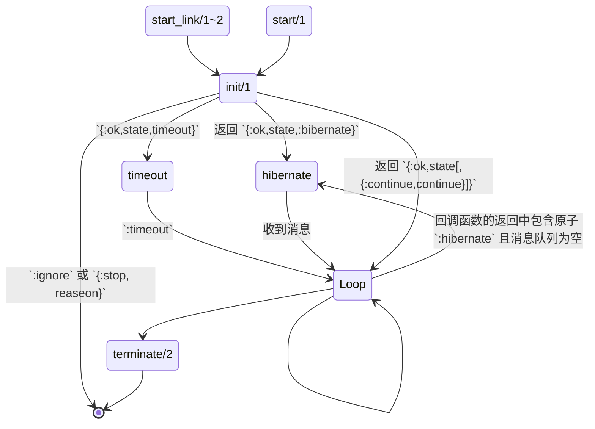
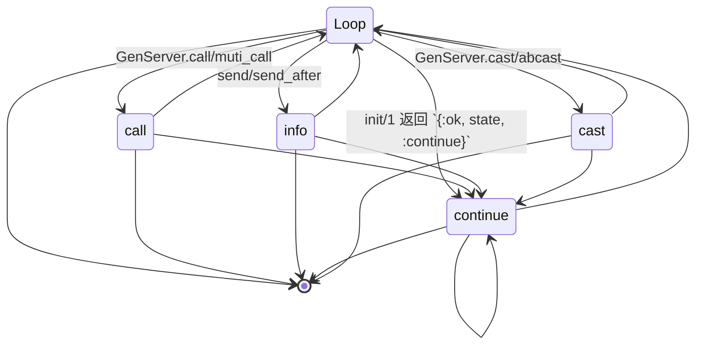

# 进程

## OTP 平台的进程

OTP 平台中, 进程与操作系统的进程不是同一个东西, 它们有许多相同的地方,
比如都是资源的调度单位, 但是 OTP 平台的进程是轻量级的, 比常规编程语言中的线程还轻量.
OTP 平台的天然的并发性与服务的自愈等特性, 都是建立在进程上的.

学习 Elixir, 基本语法之外, 更重要的就是对 OTP 平台的学习. 而要理解 OTP,
我们需要首先对 OTP 平台的进程模型有基本的认知.

在 OTP 平台, 进程是执行流和资源的分配单位. 每个进程都有自己的执行流, 
自己独立的调用栈和堆内存. 一个进程就是一个函数的执行环境. 当这个函数执行结束的时候,
进程的寿命也就结束了.

为了让进程可以持续的提供服务, 就必须使用递归调用, 在进程函数完成工作结束之前, 调用自己.

递归调用使得进程可以完成服务的工作, 但是这只是第一步,
一个无限循环如果不能从外部接受数据, 并给出回应的话, 除了消耗计算机的电力,
不见得有什么作用. OTP 平台提供了 `send(pid,message)` 函数向 `pid` 代表的进程发送信息;
`receive/1` 函数,  在进程内部接受数据.

这样在循环中, 通过 `receive/1` 接受外部的请求, 处理后通过 `send(pid,message)`
回应请求, 一个进程就可以向外部提供服务支持.

如果进程启动了, 但是并没有理会其他程序发送的消息, 该如何处理这些消息呢?
OTP 平台为每个进程提供了消息队列, 接收到消息后,
首先就是放到消息队列中, 程序执行的过程中, 遇到了 `receive/1` 语句,
就会对消息队列中的消息迭代 `receive/1` 方法, 如果消息匹配 `receive/1` 中模式,
那么这个消息就被消费掉了, 如果消息不匹配, 那么这个消息依旧保留在队列中.

当进程执行结束了, 如果进程中还有消息没有被处理,
这些消息会随着进程的结束而一起被系统归为垃圾.

启动一个进程的是核心模块的 `Kernel.spawn(fun)` 或 `Kernel.spawn(module,fun,args)`.

`receive/1` 每次每次都只处理邮箱中的一个消息, 如果没有可以处理的消息,
而且 `recieve/1` 中没有 `after` 子句的话, `receive/1` 会阻塞进程, 等待匹配的消息到来.

如果有 `after` 子句, 超过指定的时间后, 没有消息进入邮箱的话, `receive/1` 会跳转到 `after`
子句, 执行后面的处理逻辑.

```elixir
server_receive = fn this ->
  {:messages, messages} = Process.info(self(), :messages)

  IO.inspect(messages, label: "server message box have fellow messages")

  receive do
    {:add, a, b, client} -> send(client, {:add, a + b})
    {:sub, a, b, client} -> send(client, {:sub, a - b})
    {:times, a, b, client} -> send(client, {:times, a * b})
    {:divs, a, b, client} -> send(client, {:div, a / b})
  end

  this.(this)
end

server_fun = fn ->
  Process.sleep(100)
  server_receive.(server_receive)
end

server = spawn(server_fun)
client = self()
send(server, {:hello, client})
send(server, {:add, 0, 1, client})
send(server, {:sub, 3, 1, client})
send(server, {:times, 1, 3, client})
send(server, {:divs, 8, 2, client})
```

在上面的代码中, `server_fun` 在另外一个进程中运行, 进程一启动, 立刻休眠了 100 ms,
这样可以显示出消息队列的变化. 控制台的输出中, 我们可以看到消息队列, 从五个慢慢减少为一个.
匹配消息按照入队的顺序被依次的处理, 不匹配 `receive` 模式的消息则留在队列中.

```
server message box have fellow messages: [
  {:hello, #PID<0.417.0>},
  {:add, 0, 1, #PID<0.417.0>},
  {:sub, 3, 1, #PID<0.417.0>},
  {:times, 1, 3, #PID<0.417.0>},
  {:divs, 8, 2, #PID<0.417.0>}
]
server message box have fellow messages: [
  {:hello, #PID<0.417.0>},
  {:sub, 3, 1, #PID<0.417.0>},
  {:times, 1, 3, #PID<0.417.0>},
  {:divs, 8, 2, #PID<0.417.0>}
]
server message box have fellow messages: [
  {:hello, #PID<0.417.0>},
  {:times, 1, 3, #PID<0.417.0>},
  {:divs, 8, 2, #PID<0.417.0>}
]
server message box have fellow messages: [{:hello, #PID<0.417.0>}, {:divs, 8, 2, #PID<0.417.0>}]
server message box have fellow messages: [hello: #PID<0.417.0>]

```

接下来, 让通过 `IEx.Helpers.flush/0` 来查看当前进程接收到的消息.
`server_receive` 函数只能回应四则运算对应的请求, 所以, `{:hello, pid}` 一直都留在邮箱中.
通过 `Process.alive?(pid)`, 可以检查一个进程是否还活着.

```elixir
IEx.Helpers.flush()

Process.alive?(server)
|> IO.inspect(label: "Is server live? Answere")
```

```
{:add, 1}
{:sub, 2}
{:times, 3}
{:div, 4.0}
Is server live? Answere: true
```

上面的代码输出显示服务进程依旧活着, 那么我们可以继续的向其发送请求.
现在向服务进程发送两个消息.

```elixir
send(server, {:add, 3, 4, client})
send(server, {:sub, 5, 4, client})
```

控制台输出为:

```
server message box have fellow messages: [{:hello, #PID<0.417.0>}, {:sub, 5, 4, #PID<0.417.0>}]
server message box have fellow messages: [hello: #PID<0.417.0>]
```

进程运行遇到 `receive` 语句后, 如果没有消息可以匹配 `receive` 语句中的模式,
那么进程就会暂停. 等向服务器进程发送 `{:add,3,4, client}` 和 `{:sub,5,4,client}` 之后,
服务进程立刻匹配了第一个消息; 处理结束后, 进入下一次循环, 输出了第一行.
第二个循环处理 `:sub` 消息后, 开始下一个循环, 输出了第二行.

至此, 我们已经知道了如何启动一个服务, 如何处理和回应请求.
但是如何停止这个递归调用的服务进程呢?
这里有几种方法, 最常规的就是明确的用函数命令进程退出: `Process.exit(pid,reason)`.
如果服务程序运行的过程出错了, 自然也是要退出的.

在我们上面的代码中, 执行的四则运算, 四则运算是可能引发错误的. 因此,
通过向服务进程发送不能作四则运算的请求数据, 可以引发服务进程异常退出. 例如像下面这样:

```elixir
send(server, {:add, :atom, :atom2, client})

Process.alive?(server)
|> IO.inspect(label: "Is server alive? The answer is")
```

上面的代码说明, 直接把发送消息的接口暴露给客户端, 是非常危险的.
永远不要信任客户的输入. Elixir 中通常的做法是, 客户端的接口, 通过代理函数来完成.
在代理函数中完成对客户输入的检查.

上面的例子, 我们自己定义了一个服务.
我们上面的代码中, 除了我们已经指出的, 把与服务器交互的接口直接暴露给客户端,
容易引发服务进程的奔溃外, 还有一个问题, 服务进程直到死亡, 也没有把 `{:hello, pid}`
消费掉. 如果我们的进程没有退出, 这个消息将会一直存在于内存空间中, 而且不会被垃圾收集.
如果程序中存在大量这样的垃圾, 最后系统会因为内存不足, 而影响系统.

对于服务程序来说, 一方面, 都需要写 `server_fun` 这样重复性的框架代码, 另一方面,
每个人写的框架代码多少都会有些不同, 这样对代码的其他阅读者来说, 需要比较多的心智负担.
更加糟糕的是, 如果框架代码没有经过仔细的测试, 像我们上面的例子中那样,
还可能会有这样那样的 bug 存在.

OTP 平台在进程的基础上, 做了进一步的抽象, 使我们可以更统一, 规范的写服务相关的代码.
Elixir 在 OTP 的基础上, 通过 `GenServer` 模块, 提供了通用的服务模块的 API.

接下来, 我们学习 `GenServer` 的用法.

## GenServer API

`GenServer` 是一个行为. 它定义了, 8 个回调函数, 9 个和服务交互的辅助函数.

### 回调回调函数

8 个回调函数, 可以分成以下 4 组:

1. 进程初始化: `init(args)`

2. 请求处理函数

   1. `handle_info(request,state)`
   2. `handle_call(request,from,state)`
   3. `handle_cast(request,state)`
   4. `handle_continue(continue,state)`

3. 进程结束时资源清理钩子以及代码热更新钩子

   1. `terminate(reason,state)`
   2. `code_change(old_env,state,extra)`

4. 状态展示定制函数: `format_status(reason, pdict_and_state)`

### 辅助函数

9 个 辅助函数, 可以分成以下几组:

1. 发送请求的辅助函数:

   1. `GenServer.call`
   2. `GenServer.mutil_call`
   3. `GenServer.cast`
   4. `GenServer.abcast`

   这四个是对 `Kernel.send/2-3` 的抽象, 以适应向服务发送请求的通用功能.

2. 启动和结束服务器的函数:

   1. `GenServer.start`
   2. `GenServer.stat_link`
   3. `GenServer.stop`

   `GenServer.start` 是对 `spawn` 的进一步的封装; `GenServer.start_link`
   是对 `spawn_link` 的封装; 而 `GenServer.stop` 是对 `Process.exit` 的抽象.

3. 发送回应的辅助函数: `GenServer.reply` 是在 `send` 的基础上,
   为发送回应消息而作的封装.

4. 查询服务的函数: `GenServer.where_is/1` 对应的则是 `Process.where_is/1`.

### 服务进程与状态机

每个 Elixir 服务进程, 可以看作是一个状态机. 状态机是由外部的输入来改变状态的抽象机器.
把 `GenServer` 看作一个状态机, 用状态图来表示如下:



`GenServer.start` 和 `GenServer.start_link` 会启动进程.
它们首先会调用 `init/1` 回调函数.

根据 `init/1` 返回类型, 进程可能会进入四个状态: 1) 终止状态; 2) 冬眠状态;
2) 循环状态; 4) 超时.

冬眠状态指的是: 服务的消息队列为空, 服务进程停止执行循环, 开始完成垃圾收集工作.
等新消息被接受后, 服务再次开始循环.

超时状态是指: 当回调函数设置了超时参数后, 在给定的时间内, 消息队列一直都是空的,
这时进程会向自己发送 `:timeout` 消息, 会触发 回调函数 `hanlde_info`.

#### `init/1` 状态跳转表

| `init/1` 返回值                                                                        | 被触发函数, 或程序状态            |
| ------------------------------------------------------------------------------------ | ------------------------------------------- |
| 返回 `{:ok, state}`                                                         | 循环                                      |
| 返回 `{:ok, state, timeout}`,且 进程 timeout 毫秒内没有收到消息 | 进入 timeout 状态, 触发 `handle_info` |
| 返回 `{:ok,state,{:continue, contine}}`                                     | 触发 `hanlde_continue`                    |
| 返回 `{:ok,state,:hibernate}`                                               | 进程冬眠状态                          |
| 返回 `{:stop, reason}`                                                      | 进程终止                                |
| 返回 `:ignore`                                                              | 进程终止                                |


#### 触发 `terminate/2` 的行为

`terminate/2` 用来完成进程所占资源的清理工作, 它会被如下行为触发:

1. 当前进程设置了 `:trap_exit`(`Process.flag(:trap_exit, ture)`,
   而父进程发送了退出消息 `Process.exit(pid,reason)`.
2. `GenServer.stop(server,reason)`
3. 回调函数 `hanlde_*` 返回 第一个元素为 `:stop` 的元组

   | 回调              | 返回值                                                         |
   | ------------------- | ----------------------------------------------------------------- |
   | `handle_call/3`     | `{:stop, reason, reply, new_state}`, `{:stop, reason, new_state}` |
   | `handle_cast/2`     | `{:stop, reason :: term, new_state}`                              |
   | `handle_info/2`     | `{:stop, reason :: term, new_state}`                              |
   | `handle_continue/2` | `{:stop, reason :: term(), new_state}`                            |

4. 回调函数引发异常 (`raise/2`), 或者推出进程 (`exit/1`)
5. 回调函数返回的非法的值


需要注意的是 `init/1` 并不会触发 `terminate/2`.

#### Loop 节点



循环节点是我们的主节点. 用来处理接受到的消息和改变系统的状态.
循环状态中有四个子状态, `cast`, `call`, `info` 和 `continue`.
对应四种 回调函数 `handle_*`.

#### `handle_call/3` 状态变化

`GenServer.call/2-3` 或 `GenServer.mutil_call/4` 调用会触发 `handle_call/3`.
根据 `handle_call/3` 的返回值不同, 服务的状态变化表如下:

| `handle_call/3` 返回值 |       服务状态              |
|-----------------------|----------------------------|
| `{:reply, reply, new_state}` | 以 `reply` 回应请求, 服务的 state 改变, 继续循环. |
| `{:reply, reply, new_state, timeout}` | 以 `reply` 回应请求, 服务的 state 改变, 如果 `timeout` 毫秒没有没有消息进来, 进程进入 timeout 状态.    |
| `{:reply, reply, new_state, :hibernate}` | 以 `reply` 回应请求, 服务的 state 改变, 如果消息队列空了, 进程进入冬眠状态 |
| `{:reply, reply, new_state, {:continue, term}}` | 以 `reply` 回应请求, 服务的 state 改变, 处理下一个消息前, 继续执行 `handle_continue` 回调 |
| ` {:stop, reason, reply, new_state}` | 以 `reply` 回应请求, 进程的 state 改变, 服务进入 terminate 状态, `terminate/2` 被触发 | 
|`{:stop, reason, new_state}` | 进程 state 改变, 服务进入 `terminate/2` 被触发. |

#### `handle_cast/2` 状态变化

`GenServer.cast/2` 或 `GenServer.abcast/2` 会触发 `handle_cast/2` 回调函数.

根据 `handle_cast/2` 返回值的不同, 进程的状态变化如下表:

| `hanlde_cast/2` 的返回值 |             服务状态               |
|-------------------------|----------------------------------|
| `{:noreply, new_state}` | 进程的 state 改变, 进入循环, 等待处理下一个消息. |
| `{:noreply, new_state, timeout}` | 进程的 state 改变, 如果 timeout 毫秒内, 消息对立依旧为空, 进程进入冬眠模式 |
| `{:noreply, new_state,:hibernate}`| 进程的 state 改变, 如果消息对立为空, 进程进入冬眠状态 |
| `{:noreply, new_state,{:continue, term}}` | 进程的 state 改变, 在处理其他消息之前, 继续执行 `handle_continue` |
| `{:stop, reason :: term, new_state}` | 进程的 state 改变, 服务进入 terminate 状态, `terminate/2` 会被触发 |


#### `handle_info/2` 状态

`GenServer.cast`, `GenServer.abcast`, `GenServer.call`, 和 `GenServer.muti_call`
之外的方法发送给进程的消息, 都会触发 `handle_info` 回调函数.

具体来说, 以下方法的调用都会触发相应的服务的 `handle_info/2` 回调函数:

* `Kernel.send/2`
* `Process.send/2`
* `Process.send_after/3`

当服务处于 timeout 状态时, 会向进程自己发送 `:timeout` 消息.

根据 `handle_info/2` 返回值的不同, 服务的状态变化有下表表示.

| `handle_info/2` 的返回值 | 服务状态 |
|-------------------------|---------|
|`{:noreply, new_state}` | 进程 state 改变 |
|`{:noreply, new_state, timeout}` | 进程 state 改变, 如果 timeout 毫秒内, 服务的消息队列中依旧为空, 服务进入 timeout 状态 |
|`{:noreply, new_state, :hibernate}` | 进程 state 改变, 如果服务的消息队列为空, 进程进入冬眠状态. |
|`{:noreply, new_state, {:continue, term}}`| 进程 state 改变, 在处理其他消息之前, 继续执行 `handle_continue` 回调函数 | 
| `{:stop, reason :: term(), new_state}` | 进程 state 改变, 进程进入终止状态, `terminate/2` 会被调用

#### `handle_continue/2`

回调函数中含有 `:continue` 原子的时候, 会触发 `hanlde_continue/2` 回调.
`handle_continue/2` 总是在 `handle_*` 调用之后立即被调用的,
而不是在下一个的循环中被调用. 触发 `handle_continue/2`
的其他回调函数的返回情况如下:

| 回调函数 | 返回值 |
|----------|-------|
| `handle_call/3` | `{:reply, reply, new_state, {:continue, term}}`|
| `handle_cast/2` | `{:noreply, new_state,{:continue, term}}`|
| `hanlde_info/2` | `{:noreply, new_state, {:continue, term}}` |
| `hanlde_continue/2` | `{:noreply, new_state, {:continue, term()}}` |

`handle_continue/2` 返回值, 以及引发的服务状态由下表表示:

|`hanlde_continue/2` 返回值 |    状态    |
|--------------------------|------------|
| `{:noreply, new_state}` | 修改进程状态  
|`{:noreply, new_state, timeout}` | 修改进程状态, 如果 timeout 毫秒内, 消息队列依旧为空, 服务进入超时状态, 触发 `handle_info` |
|`{:noreply, new_state,:hibernate}` | 修改进程状态, 如果消息队列依旧为空, 服务进入冬眠状态 |
|`{:noreply, new_state, {:continue, term}}`| 继续执行 `handle_continue/2` 子句 |

## 基于 `GenServer` 的其他模块
`GenServer` Elixir 为我们提供的最重要的抽象.
在 `GenServer` 的基础上, Elixir 还未我们提供了如下的模块:
+ `Task` 使用进程来完成异步计算
+ `Agent` 使用服务进程来保存状态

OTP 的自愈特性, 是基于对进程的监督和重启的.

+ `Supervisor` 模块是一个行为, 用来帮助我们写出一致的管理者进程.
+ `DynamicSupervisor` 模型是一个行为, 用来帮助我们些出一致的动态管理者进程.
+ `Application` 模块是一个行为, 用来帮助我们统一启动进程数的格式和代码.

后面的章节, 会对这些模块作一一介绍.